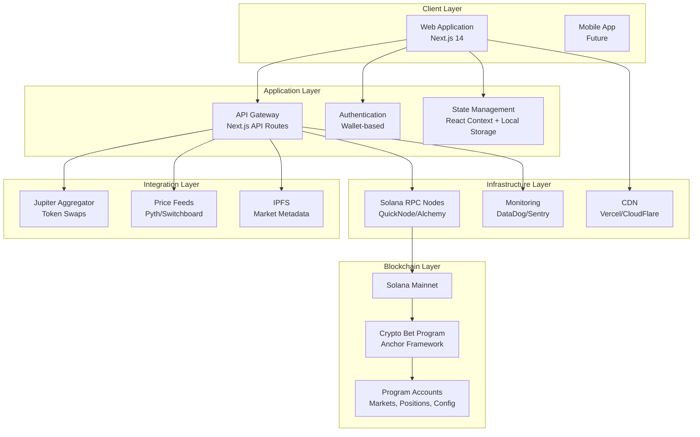
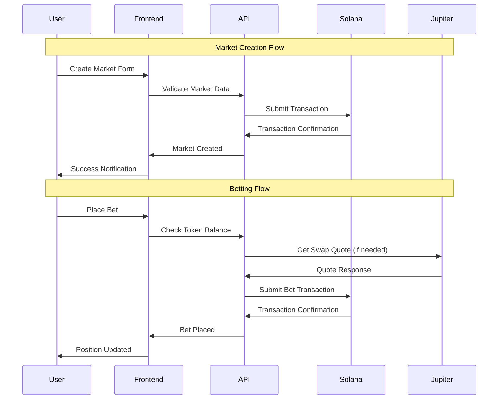
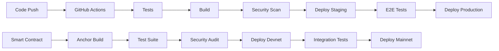

# 🏗️ System Architecture

## 📋 **Document Overview**

**Purpose**: Define the high-level system architecture for Crypto Bet prediction markets platform  
**Scope**: Complete system design from frontend to blockchain integration  
**Audience**: Technical team, stakeholders, auditors  
**Last Updated**: December 2024  
**Version**: 1.0  

---

## 🎯 **Executive Summary**

Crypto Bet is a dual-mode prediction markets platform built on Solana, offering both SOL (Degen Mode) and USDC (Stable Mode) betting options. The architecture leverages modern web technologies, Solana's high-performance blockchain, and enterprise-grade security to create a scalable, user-friendly prediction market experience.

**Key Architectural Decisions:**
- **Frontend**: Next.js 14 with App Router for optimal performance
- **Blockchain**: Solana for low fees and high throughput
- **Smart Contracts**: Anchor framework for security and developer experience
- **Data**: Real-time state management with local caching
- **Integration**: Jupiter aggregator for seamless token swapping

---

## 🏗️ **High-Level Architecture**



---

## 🎨 **Frontend Architecture**

### **Technology Stack**
| Component | Technology | Purpose | Justification |
|-----------|------------|---------|---------------|
| **Framework** | Next.js 14 | React framework | App Router, SSR, optimization |
| **Language** | TypeScript | Type safety | Enterprise-grade reliability |
| **Styling** | Tailwind CSS | Utility-first CSS | Rapid development, consistency |
| **UI Components** | shadcn/ui + Radix | Component library | Accessibility, customization |
| **State Management** | React Context | Global state | Simple, built-in solution |
| **Wallet Integration** | Solana Wallet Adapter | Wallet connectivity | Standard Solana integration |

### **Application Structure**

```
src/
├── app/                    # Next.js App Router
│   ├── (auth)/            # Protected routes
│   │   ├── dashboard/     # User dashboard
│   │   └── portfolio/     # Position management
│   ├── markets/           # Market browsing & creation
│   │   ├── [id]/         # Individual market pages
│   │   └── create/       # Market creation
│   ├── swap/              # Token swapping
│   └── api/               # API routes
│       ├── markets/       # Market data endpoints
│       ├── prices/        # Price feed endpoints
│       └── webhooks/      # External integrations
├── components/
│   ├── ui/               # Base UI components
│   ├── features/         # Feature-specific components
│   │   ├── markets/      # Market-related components
│   │   ├── wallet/       # Wallet components
│   │   └── swap/         # Swap components
│   ├── providers/        # Context providers
│   └── layouts/          # Layout components
├── lib/
│   ├── solana/          # Blockchain utilities
│   ├── jupiter/         # Swap integration
│   ├── utils/           # General utilities
│   └── hooks/           # Custom React hooks
└── types/               # TypeScript definitions
```

### **Component Architecture Patterns**

**1. Container/Presentation Pattern**
```typescript
// Container Component (logic)
export function MarketListContainer() {
  const { markets, loading } = useMarkets();
  const { selectedCategory } = useFilters();
  
  return (
    <MarketListPresentation
      markets={markets}
      loading={loading}
      category={selectedCategory}
    />
  );
}

// Presentation Component (UI)
export function MarketListPresentation({ markets, loading, category }) {
  return (
    <div className="grid grid-cols-1 md:grid-cols-2 lg:grid-cols-3 gap-6">
      {/* Render markets */}
    </div>
  );
}
```

**2. Custom Hooks Pattern**
```typescript
// Business logic encapsulation
export function useMarketActions(marketId: string) {
  const { connection } = useConnection();
  const { publicKey, signTransaction } = useWallet();
  
  const placeBet = useCallback(async (amount: number, side: 'yes' | 'no') => {
    // Smart contract interaction logic
  }, [connection, publicKey]);
  
  return { placeBet };
}
```

---

## ⛓️ **Blockchain Architecture**

### **Solana Program Structure**

```rust
// Program Account Structure
pub struct Market {
    pub authority: Pubkey,           // Market creator
    pub market_id: u64,             // Unique identifier
    pub title: String,              // Market question
    pub description: String,        // Detailed description
    pub category: String,           // Market category
    pub resolution_time: i64,       // When to resolve
    pub state: MarketState,         // Active/Resolved/Cancelled
    pub market_type: MarketType,    // Degen(SOL) or Stable(USDC)
    pub accepted_mint: Pubkey,      // SOL or USDC mint
    pub yes_pool: u64,             // Total YES bets
    pub no_pool: u64,              // Total NO bets
    pub total_volume: u64,         // Lifetime volume
    pub resolution_result: Option<bool>, // Final outcome
    pub bump: u8,                  // PDA bump seed
}

pub struct Position {
    pub user: Pubkey,              // Bettor's wallet
    pub market: Pubkey,            // Market account
    pub yes_shares: u64,           // YES position size
    pub no_shares: u64,            // NO position size
    pub claimed: bool,             // Winnings claimed flag
    pub bump: u8,                 // PDA bump seed
}
```

### **Smart Contract Functions**

| Function | Purpose | Access Control | Security Features |
|----------|---------|----------------|-------------------|
| `initialize_market` | Create new market | Authority only | Input validation, time limits |
| `place_bet` | Submit prediction | Any user | Amount validation, market active |
| `resolve_market` | Set final outcome | Authority only | Time validation, finality |
| `claim_winnings` | Withdraw rewards | Position holders | Double-claim prevention |
| `claim_refund` | Refund cancelled | Position holders | Market cancelled only |
| `cancel_market` | Cancel before resolution | Authority only | No bets placed |

### **Program Derived Addresses (PDAs)**

```rust
// Market PDA: Deterministic market addresses
let (market_pda, bump) = Pubkey::find_program_address(
    &[
        b"market",
        &market_id.to_le_bytes(),
        authority.as_ref(),
    ],
    program_id
);

// Position PDA: User-specific positions
let (position_pda, bump) = Pubkey::find_program_address(
    &[
        b"position", 
        user.as_ref(),
        market.as_ref(),
    ],
    program_id
);
```

---

## 💾 **Data Architecture**

### **Data Flow Patterns**



### **State Management Strategy**

**1. Global State (React Context)**
```typescript
interface AppState {
  // User state
  wallet: WalletState;
  user: UserProfile | null;
  
  // Market state
  markets: Market[];
  filters: MarketFilters;
  
  // UI state
  theme: 'light' | 'dark';
  bettingMode: 'degen' | 'stable';
}
```

**2. Local State Management**
- **Component State**: Form inputs, UI toggles
- **Custom Hooks**: Business logic, API calls
- **URL State**: Filters, pagination, market selection

**3. Persistent State**
- **LocalStorage**: User preferences, betting mode
- **SessionStorage**: Temporary form data
- **Wallet**: Connection state, transaction history

### **Caching Strategy**

| Data Type | Cache Duration | Invalidation Strategy |
|-----------|----------------|----------------------|
| **Market Data** | 30 seconds | Real-time subscriptions |
| **Price Feeds** | 5 seconds | WebSocket updates |
| **User Positions** | 60 seconds | Transaction confirmations |
| **Static Data** | 24 hours | Version-based invalidation |

---

## 🔗 **Integration Architecture**

### **Jupiter Aggregator Integration**

```typescript
// Token Swap Service
class JupiterSwapService {
  async getSwapQuote(params: SwapQuoteParams): Promise<SwapQuote> {
    const response = await fetch(`${JUPITER_API}/quote`, {
      method: 'POST',
      body: JSON.stringify(params)
    });
    return response.json();
  }
  
  async executeSwap(quote: SwapQuote, wallet: Wallet): Promise<string> {
    const { swapTransaction } = await fetch(`${JUPITER_API}/swap`, {
      method: 'POST',
      body: JSON.stringify({ 
        quoteResponse: quote,
        userPublicKey: wallet.publicKey 
      })
    }).then(res => res.json());
    
    const transaction = Transaction.from(
      Buffer.from(swapTransaction, 'base64')
    );
    
    const signature = await wallet.sendTransaction(transaction);
    return signature;
  }
}
```

### **Price Feed Integration**

```typescript
// Real-time Price Service
class PriceFeedService {
  private ws: WebSocket | null = null;
  
  subscribeToPrice(tokenMint: string, callback: (price: number) => void) {
    this.ws = new WebSocket(`${PYTH_WS_ENDPOINT}`);
    
    this.ws.onmessage = (event) => {
      const data = JSON.parse(event.data);
      if (data.type === 'price_update' && data.symbol === tokenMint) {
        callback(data.price);
      }
    };
  }
  
  async getHistoricalPrices(tokenMint: string, timeframe: string) {
    const response = await fetch(`${PRICE_API}/history`, {
      params: { token: tokenMint, timeframe }
    });
    return response.json();
  }
}
```

---

## 🔒 **Security Architecture**

### **Security Layers**

**1. Frontend Security**
- Input sanitization (DOMPurify)
- XSS prevention (CSP headers)
- CSRF protection (SameSite cookies)
- Wallet validation and signature verification

**2. Smart Contract Security**
- Authority validation (`has_one` constraints)
- Overflow protection (`checked_add/sub/mul/div`)
- State management (proper account validation)
- Double-claiming prevention

**3. Infrastructure Security**
- HTTPS enforcement (HSTS headers)
- API rate limiting
- Environment variable protection
- Monitoring and alerting

### **Authentication & Authorization**

```typescript
// Wallet-based Authentication
class AuthService {
  async authenticateWallet(publicKey: PublicKey, signature: string): Promise<AuthToken> {
    // Verify signature against known message
    const message = `Sign in to Crypto Bet: ${Date.now()}`;
    const isValid = await this.verifySignature(publicKey, signature, message);
    
    if (!isValid) {
      throw new Error('Invalid signature');
    }
    
    // Generate JWT token
    return this.generateToken(publicKey);
  }
  
  async authorizeAction(token: string, action: string, resource: string): Promise<boolean> {
    const payload = this.verifyToken(token);
    return this.checkPermissions(payload.publicKey, action, resource);
  }
}
```

---

## 📊 **Performance Architecture**

### **Optimization Strategies**

**1. Frontend Optimizations**
- **Code Splitting**: Route-based and component-based
- **Image Optimization**: Next.js automatic optimization
- **Caching**: Aggressive CDN and browser caching
- **Bundle Analysis**: Webpack bundle analyzer integration

**2. Blockchain Optimizations**
- **Transaction Batching**: Multiple operations in single transaction
- **Account Prefetching**: Preload account data
- **RPC Load Balancing**: Multiple RPC endpoints
- **Local Validation**: Client-side validation before submission

**3. Database Optimizations**
- **Indexing Strategy**: Optimized queries for market data
- **Connection Pooling**: Efficient database connections
- **Query Optimization**: Minimize blockchain queries
- **Caching Layers**: Redis for frequently accessed data

### **Monitoring & Observability**

```typescript
// Performance Monitoring Service
class PerformanceMonitor {
  trackPageLoad(pageName: string, loadTime: number) {
    // Send to analytics service
    analytics.track('page_load', {
      page: pageName,
      load_time: loadTime,
      user_agent: navigator.userAgent
    });
  }
  
  trackTransaction(txType: string, duration: number, success: boolean) {
    analytics.track('transaction', {
      type: txType,
      duration,
      success,
      timestamp: Date.now()
    });
  }
}
```

---

## 🚀 **Scalability Architecture**

### **Horizontal Scaling Strategy**

**1. Frontend Scaling**
- **CDN Distribution**: Global edge caching
- **Load Balancing**: Multiple server instances
- **Static Generation**: Pre-built pages where possible
- **Edge Functions**: Geographically distributed API

**2. Backend Scaling**
- **Microservices**: Service separation as needed
- **Database Scaling**: Read replicas for market data
- **Caching Layers**: Redis clusters for session data
- **Queue Systems**: Background job processing

### **Vertical Scaling Considerations**

| Component | Current Capacity | Scale Trigger | Scale Action |
|-----------|------------------|---------------|--------------|
| **Web Servers** | 1000 CCU | 80% CPU usage | Add instances |
| **Database** | 10,000 QPS | Query latency > 100ms | Add read replicas |
| **Cache** | 10GB RAM | Memory usage > 80% | Increase capacity |
| **RPC Calls** | 1000 RPS | Rate limiting hit | Add RPC endpoints |

---

## 🔧 **Development Architecture**

### **Environment Strategy**

```
Development → Staging → Production
     ↓           ↓          ↓
   Devnet   →  Devnet  → Mainnet
```

**Environment Configuration:**
- **Development**: Local development, hot reloading
- **Staging**: Production-like testing, devnet integration
- **Production**: Live system, mainnet integration

### **CI/CD Pipeline**



### **Testing Strategy Architecture**

| Test Type | Coverage | Tools | Environment |
|-----------|----------|-------|-------------|
| **Unit Tests** | Functions, hooks | Jest, RTL | Local |
| **Integration Tests** | API endpoints | Supertest | Local/Staging |
| **E2E Tests** | User workflows | Playwright | Staging |
| **Smart Contract Tests** | Program functions | Anchor Test | Local/Devnet |
| **Security Tests** | Vulnerability scans | Custom tools | All |

---

## 📈 **Analytics Architecture**

### **Data Collection Strategy**

```typescript
// Analytics Service
class AnalyticsService {
  // User behavior tracking
  trackUserAction(action: string, properties: Record<string, any>) {
    this.send('user_action', {
      action,
      properties,
      timestamp: Date.now(),
      session_id: this.getSessionId(),
      user_id: this.getUserId()
    });
  }
  
  // Business metrics tracking  
  trackBusinessMetric(metric: string, value: number, metadata: any) {
    this.send('business_metric', {
      metric,
      value,
      metadata,
      timestamp: Date.now()
    });
  }
  
  // Performance tracking
  trackPerformance(metric: string, duration: number) {
    this.send('performance', {
      metric,
      duration,
      timestamp: Date.now(),
      url: window.location.href
    });
  }
}
```

### **Key Metrics Dashboard**

| Category | Metrics | Purpose |
|----------|---------|---------|
| **Business** | Volume, Users, Markets | Growth tracking |
| **Technical** | Load time, Error rate | Performance |
| **User Experience** | Conversion, Retention | Product optimization |
| **Security** | Failed auth, Anomalies | Security monitoring |

---

## 🔄 **Disaster Recovery Architecture**

### **Backup Strategy**

**1. Application Data**
- **Database**: Daily automated backups
- **User Data**: Real-time replication
- **Configuration**: Version controlled

**2. Blockchain Data**
- **Program State**: Immutable on Solana
- **Transaction History**: Archived off-chain
- **Account Snapshots**: Daily state backups

### **Recovery Procedures**

| Failure Type | RTO | RPO | Recovery Steps |
|--------------|-----|-----|----------------|
| **Server Failure** | 5 minutes | 0 | Auto-failover to backup |
| **Database Failure** | 15 minutes | 1 hour | Restore from backup |
| **Program Bug** | 1 hour | 0 | Deploy fixed program |
| **Total Outage** | 4 hours | 24 hours | Full system restore |

---

## 📚 **Technical Decisions & Rationale**

### **Major Architectural Decisions**

| Decision | Options Considered | Chosen | Rationale |
|----------|-------------------|--------|-----------|
| **Frontend Framework** | React, Vue, Angular | Next.js 14 | SSR, performance, ecosystem |
| **Blockchain** | Ethereum, Solana, Polygon | Solana | Low fees, high throughput |
| **Smart Contract Framework** | Native, Anchor | Anchor | Security, developer experience |
| **Styling** | CSS Modules, Styled Components, Tailwind | Tailwind | Rapid development, consistency |
| **State Management** | Redux, Zustand, Context | Context + Hooks | Simplicity, built-in solution |

### **Trade-offs Analysis**

**Performance vs. Decentralization**
- **Choice**: Hybrid approach with client-side caching
- **Trade-off**: Some centralized components for better UX
- **Mitigation**: Critical operations remain on-chain

**Security vs. Usability**
- **Choice**: Wallet-based authentication
- **Trade-off**: Higher barrier to entry
- **Mitigation**: Clear onboarding and education

**Development Speed vs. Scalability**
- **Choice**: Monolithic frontend with modular smart contracts
- **Trade-off**: Initial simplicity over long-term scaling
- **Mitigation**: Clear migration path to microservices

---

## 🔮 **Future Architecture Considerations**

### **Planned Enhancements**

**Phase 2: Advanced Features**
- Real-time market updates via WebSockets
- Advanced analytics and charting
- Mobile application development
- Multi-language support

**Phase 3: Scale Optimization**
- Microservices architecture
- Advanced caching strategies
- Machine learning integration
- Multi-chain support

### **Technical Debt Management**

- **Monthly Architecture Reviews**: Assess technical debt
- **Refactoring Sprints**: Dedicated improvement cycles  
- **Performance Budgets**: Enforce performance standards
- **Security Audits**: Regular third-party assessments

---

## 📋 **Implementation Checklist**

### **Phase 1: Foundation**
- [ ] Set up Next.js project with TypeScript
- [ ] Configure Tailwind CSS and component library
- [ ] Implement wallet integration
- [ ] Create basic market display
- [ ] Set up Solana program development

### **Phase 2: Core Features**
- [ ] Implement market creation functionality
- [ ] Add betting mechanics
- [ ] Integrate Jupiter for token swaps
- [ ] Build position management
- [ ] Add market resolution system

### **Phase 3: Production Ready**
- [ ] Implement comprehensive error handling
- [ ] Add monitoring and analytics
- [ ] Set up CI/CD pipeline
- [ ] Conduct security audit
- [ ] Deploy to mainnet

---

## 📞 **Architecture Governance**

### **Decision Making Process**
1. **Proposal**: Technical proposal with rationale
2. **Review**: Stakeholder and technical review
3. **Decision**: Architecture committee decision
4. **Documentation**: Update architecture documents
5. **Implementation**: Phased rollout with monitoring

### **Architecture Review Board**
- **Technical Lead**: Overall architecture decisions
- **Security Lead**: Security architecture review
- **Product Lead**: Product-architecture alignment
- **DevOps Lead**: Infrastructure and deployment

---

*This system architecture document serves as the authoritative source for technical decisions and system design. All development should align with this architecture, and any deviations should be documented and approved through the governance process.*

**Next Review**: Monthly architecture review meeting  
**Document Owner**: Technical Architecture Team  
**Approval**: Architecture Review Board