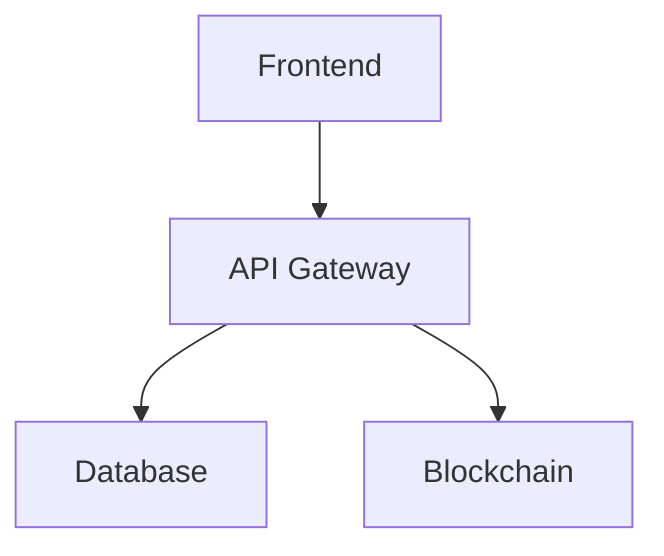

# 🖼️ Visual Documentation Assets

This folder contains all visual documentation including diagrams, charts, wireframes, and other visual assets.

## 📁 **Contents**

### **✅ Existing Diagrams**
- **system_architecture_diagram.png** - High-level system architecture
- **deployment_guide_diagram.png** - Infrastructure and deployment flow  
- **testing_strategy_diagram.png** - Testing approach and coverage

### **📋 Planned Visual Assets**

#### **🏗️ Architecture Diagrams**
- [ ] **database_schema_diagram.png** - Database relationships and structure
- [ ] **api_flow_diagram.png** - API request/response flows
- [ ] **blockchain_integration_diagram.png** - Solana program interactions
- [ ] **security_architecture_diagram.png** - Security layers and controls
- [ ] **data_flow_diagram.png** - Data movement and processing

#### **📊 Product Diagrams**
- [ ] **user_journey_map.png** - End-to-end user experience flows
- [ ] **wireframes/** - UI/UX wireframes and mockups
- [ ] **component_hierarchy.png** - React component structure
- [ ] **feature_flowchart.png** - Feature interaction flows

#### **🔧 Operations Diagrams**
- [ ] **ci_cd_pipeline.png** - Development and deployment pipeline
- [ ] **monitoring_dashboard.png** - Observability and alerting setup
- [ ] **incident_response_flow.png** - Emergency response procedures

## 📝 **Visual Asset Standards**

### **File Naming Convention**
```
[category]_[description]_[type].[extension]

Examples:
- architecture_system_overview_diagram.png
- product_user_journey_flowchart.svg
- operations_deployment_pipeline.png
- business_competitive_analysis_chart.png
```

### **File Formats & Guidelines**
- **Diagrams**: SVG preferred (scalable), PNG acceptable
- **Wireframes**: SVG or high-resolution PNG
- **Charts**: SVG preferred for web display
- **Screenshots**: PNG with consistent resolution
- **Flowcharts**: SVG with Mermaid.js source code

### **Mermaid.js Diagrams**
All technical diagrams should be created using Mermaid.js when possible:

```markdown
## System Architecture


### **Design Standards**
- **Color Scheme**: Consistent brand colors
- **Typography**: Clean, readable fonts
- **Resolution**: Minimum 1920x1080 for detailed diagrams
- **Background**: White or transparent backgrounds
- **Accessibility**: High contrast, clear labels

## 🎯 **Visual Documentation Workflow**

1. **Planning**: Define diagram purpose and audience
2. **Creation**: Use appropriate tools (Mermaid.js, Figma, etc.)
3. **Review**: Technical and design review
4. **Optimization**: Compress for web while maintaining quality
5. **Documentation**: Add descriptions and context
6. **Maintenance**: Regular updates with system changes

## 🛠️ **Recommended Tools**

### **Diagram Creation**
- **Mermaid.js**: Technical flowcharts and diagrams
- **Figma**: UI/UX wireframes and mockups
- **Lucidchart**: Complex system diagrams
- **Draw.io**: Free alternative for technical diagrams

### **Image Optimization**
- **TinyPNG**: Image compression
- **SVGO**: SVG optimization
- **ImageOptim**: Batch image optimization

## 📚 **Integration Guidelines**

### **Embedding in Documentation**
```markdown
## System Architecture


*Figure 1: High-level system architecture showing the relationship between frontend, backend, and blockchain components.*
```

### **Version Control**
- Source files should be version controlled when possible
- Include both source and exported formats
- Update diagrams when system changes occur
- Maintain change log for major diagram updates

**Asset Owner**: Design & Documentation Team  
**Last Review**: December 2024  
**Review Cycle**: Monthly or with major system changes